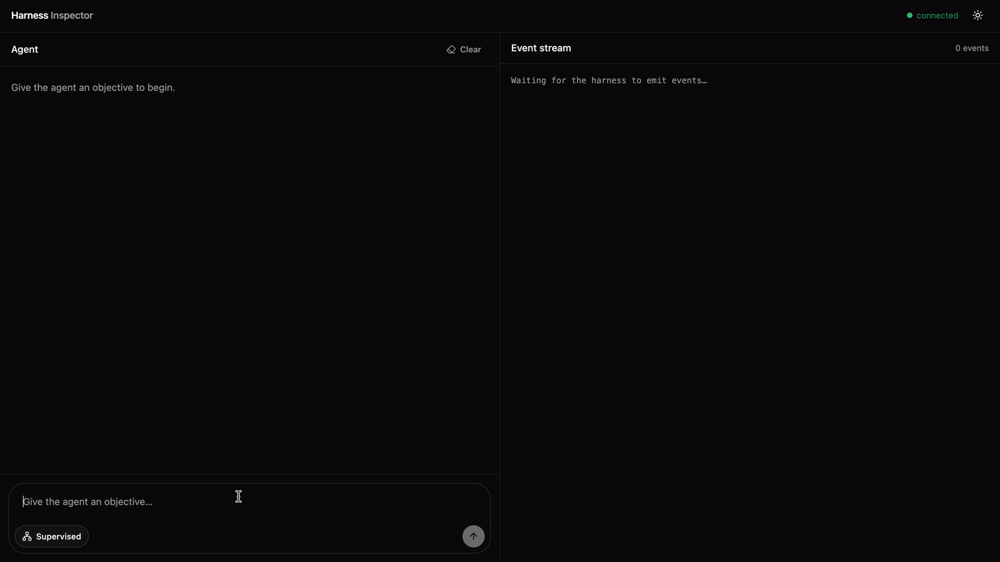
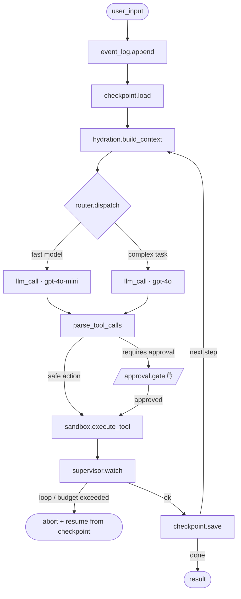

# 🧠 Agent Harness — Mini Agent Runtime from Scratch

> Not just another agent — the runtime that durably runs all of them.

A minimal, production-grade execution engine for AI agents — written in pure Python with no agent framework dependencies. Event log, checkpointing, sandboxed tools, context hydration, routing, supervision, and human approval, wired together from scratch.

## Demo




---

## Architecture



---

## Components

| File            | Responsibility                                                        |
| --------------- | --------------------------------------------------------------------- |
| `log.py`        | Append-only SQLite event log — every call, result, and error in order |
| `checkpoint.py` | Save and resume agent state — crash-safe, idempotent                  |
| `sandbox.py`    | Isolated tool executor — timeout, memory cap, no network by default   |
| `hydration.py`  | Build each LLM prompt from stored state, not a growing chat history   |
| `router.py`     | Route each step to the right model or sub-agent based on complexity   |
| `supervisor.py` | Watch for infinite loops, budget overruns, and stalled steps          |
| `approval.py`   | Hard gate before destructive actions — pauses until human approves    |
| `runner.py`     | Main loop wiring all seven components in sequence                     |
| `tools.py`      | Example sandboxed tools (search, code execution, email)               |

---

## How It Works

Every agent step runs through three parallel concerns:

**Durability** — `event_log` → `checkpoint.load` → _(step)_ → `checkpoint.save`  
**Safety** — `approval.gate` → `sandbox.execute` → `supervisor.watch`  
**Intelligence** — `hydration.build` → `router.dispatch` → `llm_call` → `parse_tool_calls`

If the process crashes mid-run, the next invocation loads the last checkpoint and replays from there. The event log is never edited — only appended to.

---

## Quickstart

```bash
git clone https://github.com/intishar-rafi/agent-harness
cd agent-harness
pip install openai
cp .env.example .env   # add OPENAI_API_KEY
python -c "from log import init_db; init_db()"
python runner.py --task "your task here"
```

---

## Project Structure

```
runtime/
  log.py            # append-only event log (SQLite)
  checkpoint.py     # save / resume agent state
  sandbox.py        # isolated tool executor
  hydration.py      # build prompt from state
  router.py         # model / agent routing
  supervisor.py     # loop & budget guard
  approval.py       # human-in-the-loop gate
  runner.py         # main execution loop
  tools.py          # example sandboxed tools
runs.db             # event log database
.env.example
```

---

## Key Design Decisions

**Human approval lives in the tool, not the prompt.**  
Telling the LLM "ask before doing X" is non-deterministic. The `approval.gate()` function is called unconditionally in the tool executor — the agent cannot skip it.

**Context hydration, not chat history.**  
Instead of passing a growing list of messages to the LLM, `hydration.py` builds each prompt from structured state. This keeps context windows predictable and avoids compaction surprises.

**Checkpoints are idempotent.**  
`checkpoint.save()` writes to a keyed store. Re-running a step that already checkpointed is a no-op — it just loads the saved result instead of re-executing.

---

## Inspecting a Run

Every event is stored in `runs.db` and can be queried directly:

```bash
sqlite3 runs.db "SELECT step, event_type, payload FROM events WHERE run_id='<id>' ORDER BY ts"
```
